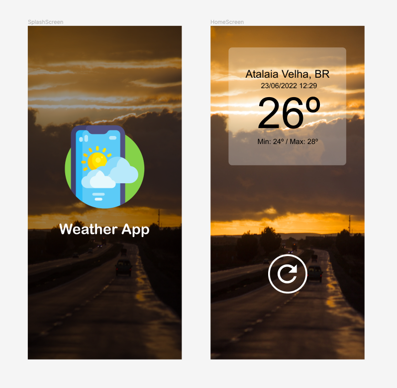

# Weather App

    

    
    

## Tecnologias utilizadas

- Expo
- Expo Location
- React Native
- Context API
- Axios
- Typescript
- Date FNS
- DotEnv
- Styled Components

## API

- Para obter os dados meteorológicos foi utilizada a API `https://openweathermap.org/api`

### Instalação

- Clone este repositório: `git clone https://github.com/rafabarbosa/weather-app.git`
- Entre na pasta através do comando: `cd weather-app`
- Instalar todas as dependências do projeto: `yarn install`
- Executar o EXPO para rodar a aplicação: `expo start`

### Feedback

Feedbacks são sempre bem vindos.
